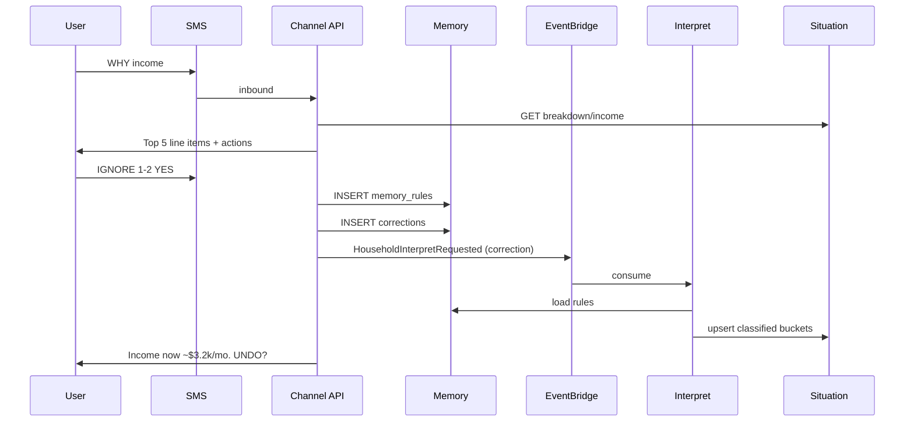

# Transaction Memory & SMS Corrections

Plan for user-defined classification rules and line-item drill-down, delivered lightweight over SMS (and MfB-shaped prototypes). Implements **Layer A + B + D** from the Corrections brainstorm, with **Layer E (web sheet)** deferred to a follow-on slice.

**Status:** Phase 1 implemented  
**Depends on:** Interpret v1 (`situations` table, `HouseholdInterpretRequested`)  
**Terminology:** [docs/terminology.md](../terminology.md) — Memory, Correction, Policy, Situation

---

## Problem

Interpret v1 classifies depository transactions with naive heuristics (90-day average, internal transfer string matching). Real households need:

1. **Ignore** one-off or non-economic flows (e.g. Morgan Stanley investment transfers).
2. **Reclassify** recurring merchants (e.g. Rocket Payment → payroll, not “loan credit”).
3. **See line items** behind Situation numbers (income, outflow, runway).
4. **Manage rules** without re-explaining every month.

The **ledger stays immutable** (Plaid facts). Classification is an overlay in **Memory**, applied at Interpret time.

---

## Principles

| Principle | Implication |
|---|---|
| Ledger ≠ understanding | Never mutate `transactions`; store rules and per-txn overrides separately |
| Corrections → Interpret | Any Memory write triggers `HouseholdInterpretRequested` with `trigger: correction` |
| SMS-first, sheet-second | Drill-down and rule creation work in ≤3 taps / one short reply; link out only when >5 rows |
| Confirm before retroactive | Default: apply new rules to last 90 days; echo exact pattern; `UNDO` / `YES` gate |
| Rules match patterns, not IDs | `raw_name` / merchant substring, optional account scope |
| Penny learns once | “Memory (they already told us)” — don’t re-ask for classified merchants |

---

## Product model

### Memory types (v1)

| Type | User intent | Effect on Interpret |
|---|---|---|
| **`ignore`** | “Don’t count this in income/outflow/runway” | Transaction excluded from all Situation buckets |
| **`payroll`** | “This is my paycheck” | Counts toward **income** / `income_shape` |
| **`transfer`** | “Moving my own money” | Excluded (like internal TFR; user-defined supplement) |
| **`debt_service`** | “Paying down cards/loans” | Counts toward **debt_service** bucket; excluded from **operating outflow** (Policy toggle later) |

Future: `investment`, `reimbursement`, `must_pay`, merchant-specific tags.

### Precedence (highest wins)

1. **Per-transaction override** (`transaction_overrides`) — one txn exception  
2. **Household Memory rule** (`memory_rules`) — pattern match  
3. **Built-in heuristics** (INTERNET TFR, MONEYLINE, etc.)  
4. **Default** — depository positive = outflow, negative = inflow  

### Situation output (v2)

Extend `situations` JSON (or add columns) with **classified buckets**:

```json
{
  "income": { "payroll_cents": 966142, "other_inflow_cents": 0, "line_items": [...] },
  "outflow": {
    "operating_cents": 429300,
    "debt_service_cents": 2169244,
    "line_items": [...]
  },
  "excluded": { "ignored_cents": 13242459, "transfer_cents": 68139038, "line_items": [...] },
  "rules_applied": ["rule_uuid_1", "rule_uuid_2"]
}
```

**Runway variants** (expose one primary in SMS, others on drill-down):

- **Operating runway** — liquid ÷ operating outflow (excludes debt_service unless Policy says otherwise)  
- **All-cash runway** — liquid ÷ all non-ignored outflow (v1 behavior, labeled clearly)

---

## Data model

### `memory_rules`

Standing household rules from Corrections.

```sql
CREATE TABLE memory_rules (
  id              UUID PRIMARY KEY DEFAULT gen_random_uuid(),
  household_id    UUID NOT NULL REFERENCES households(id) ON DELETE CASCADE,
  -- matching
  match_field     TEXT NOT NULL DEFAULT 'raw_name'
                  CHECK (match_field IN ('raw_name', 'merchant_name', 'either')),
  match_pattern   TEXT NOT NULL,          -- case-insensitive substring or normalized regex
  account_id      UUID REFERENCES accounts(id) ON DELETE SET NULL,  -- NULL = all accounts
  -- action
  action          TEXT NOT NULL
                  CHECK (action IN ('ignore', 'payroll', 'transfer', 'debt_service')),
  -- provenance
  source          TEXT NOT NULL DEFAULT 'user'
                  CHECK (source IN ('user', 'penny_suggested', 'import')),
  source_channel  TEXT,                   -- 'sms', 'mfb', 'web', 'api'
  created_by      UUID REFERENCES people(id),
  note            TEXT,                     -- optional user note ("I work at Rocket")
  active          BOOLEAN NOT NULL DEFAULT true,
  created_at      TIMESTAMPTZ NOT NULL DEFAULT now(),
  updated_at      TIMESTAMPTZ NOT NULL DEFAULT now()
);

CREATE INDEX memory_rules_household_active_idx ON memory_rules(household_id) WHERE active;
```

**Example rows (Robert’s household):**

| match_pattern | action | note |
|---|---|---|
| `ROCKET PAYMENT` | payroll | Works at Rocket Companies |
| `MORGAN STANLEY` | ignore | Investment transfers |

### `transaction_overrides`

Single-transaction exceptions (one-time sale, mis-click rule, etc.).

```sql
CREATE TABLE transaction_overrides (
  id                      UUID PRIMARY KEY DEFAULT gen_random_uuid(),
  household_id            UUID NOT NULL REFERENCES households(id) ON DELETE CASCADE,
  plaid_transaction_id    TEXT NOT NULL,
  action                  TEXT NOT NULL
                          CHECK (action IN ('ignore', 'payroll', 'transfer', 'debt_service', 'default')),
  reason                  TEXT,
  created_at              TIMESTAMPTZ NOT NULL DEFAULT now(),
  UNIQUE (household_id, plaid_transaction_id)
);
```

`action = 'default'` means “clear override, fall back to rules.”

### `corrections` (audit log)

Append-only log for undo and support.

```sql
CREATE TABLE corrections (
  id              UUID PRIMARY KEY DEFAULT gen_random_uuid(),
  household_id    UUID NOT NULL REFERENCES households(id) ON DELETE CASCADE,
  person_id       UUID REFERENCES people(id),
  channel         TEXT NOT NULL,
  raw_input       TEXT,                     -- SMS body or quick-reply id
  parsed_intent   JSONB NOT NULL,           -- structured parse result
  rule_id         UUID REFERENCES memory_rules(id),
  override_id     UUID REFERENCES transaction_overrides(id),
  created_at      TIMESTAMPTZ NOT NULL DEFAULT now()
);
```

---

## Interpret pipeline change

```
Ledger txns
  → load active memory_rules + transaction_overrides
  → classify each txn (precedence above)
  → bucket: payroll | operating_out | debt_service | ignored | transfer
  → aggregate 90d → monthly estimates
  → persist situations (+ line_item summaries in JSONB)
```

**Trigger:** `HouseholdInterpretRequested` with `trigger: correction | ledger_ingest | manual`.

**New module:** `src/interpret/classifyTransaction.ts` — pure function, unit-tested with Robert’s Rocket / Morgan Stanley fixtures.

---

## SMS UX — three layers

### Layer A: Drill-down (“Fix this number”)

**Entry points:**

- User: `why income`, `why bills`, `why runway`
- Penny proactive: after Situation push — “Income looks high — tap Why?”
- MfB quick reply: **Why?** / **Fix income** / **Fix bills** (extends existing audit script)

**Flow:**

```
Penny: Monthly in ~$58k (90d avg). Top lines:
  1. Morgan Stanley — $74,000 (Jun 3)
  2. Morgan Stanley — $50,209 (Jun 4)
  3. Rocket Payment — $3,895 (Jul 31)
  4. RHP Staffing — $1,507 (Aug 20)

Reply: IGNORE 1-2 | PAYROLL 3 | LIST 3 | MORE | DONE
```

- **LIST 3** — all Rocket Payment txns in window (paginated, 5 per message)  
- **IGNORE 1-2** — draft rule on Morgan Stanley; confirm (see Layer B)  
- **MORE** — next page  

After action → confirm → Interpret → reply with delta:

```
Penny: Updated. Income ~$3.2k/mo (was $58k).
Ignored Morgan Stanley ($132k in 90d).
Reply UNDO or RULES.
```

### Layer B: Natural correction + confirm

**Entry:** free-text anytime.

```
User: Rocket Payment is my payroll. Ignore Morgan Stanley deposits.

Penny: I'll save:
  • "ROCKET PAYMENT" → payroll
  • "MORGAN STANLEY" → ignore
Apply to last 90 days? Reply YES / EDIT / NO
```

**EDIT** → narrow pattern (“ROCKET PAYMENT only, not ROCKET MORTGAGE”) via one follow-up.

**Parser:** start with keyword extraction (Layer D); optional LLM for Explore channel later — SMS uses deterministic parse first.

### Layer D: Keyword engine (implementation backbone)

| Command | Example | Action |
|---|---|---|
| `IGNORE <pattern>` | `IGNORE morgan stanley` | Create ignore rule |
| `PAYROLL <pattern>` | `PAYROLL rocket payment` | Create payroll rule |
| `DEBT <pattern>` | `DEBT chase autopay` | debt_service rule |
| `RULES` | | List active rules (numbered) |
| `DROP RULE 2` | | Deactivate rule |
| `UNDO` | | Revert last correction + re-interpret |
| `WHY <bucket>` | `WHY income` | Layer A drill-down |
| `HELP` | | Command summary |

Keywords are case-insensitive; patterns stored uppercased normalized.

---

## Channel architecture

SMS/MfB is a **thin client**. It does not compute Situation.

```
SMS webhook → thread state machine → Correction API → Memory DB
                                    → publish HouseholdInterpretRequested
                                    → (async) Situation updated
                                    → SMS reply with summary
```

### API (workflow-processor or future `penny-api`)

| Method | Path | Purpose |
|---|---|---|
| GET | `/api/household/:id/situation/breakdown?bucket=income&limit=5&offset=0` | Line items for drill-down |
| GET | `/api/household/:id/memory/rules` | List rules |
| POST | `/api/household/:id/memory/rules` | Create rule (from SMS parser or UI) |
| PATCH | `/api/household/:id/memory/rules/:ruleId` | Deactivate / edit |
| POST | `/api/household/:id/corrections/undo` | Undo last correction |
| POST | `/api/household/:id/interpret` | Already exists — trigger recompute |

### Thread state (SMS)

Store in `thread_sessions` (or Redis):

```json
{
  "household_id": "...",
  "mode": "drill_down_income",
  "page": 0,
  "pending_rule": { "pattern": "MORGAN STANLEY", "action": "ignore" },
  "awaiting": "confirm_yes_no"
}
```

TTL ~24h; **DONE** clears state.

### MfB prototype mapping

Extend `tools/mfb-prototype` audit script:

- **runway_why** → call breakdown API, render list picker (“Fix line 1”, “Ignore Morgan Stanley”, …)  
- Quick replies map to Layer D commands internally  

Same backend as SMS; different presentation.

---

## Layer E (deferred): Web sheet

When user sends `SHOW ALL income` or >5 line items:

```
Penny: Full breakdown (47 txns):
  https://penny.app/h/:token/breakdown/income
Rules applied: 2. Tap a row to ignore or reclassify.
```

Tokenized, short-lived, mobile table. Not in v1 slice.

---

## Phased delivery

### Phase 1 — Memory + Interpret (backend only)

**Goal:** Rules change Situation; provable with API + your real data.

- [ ] Migration: `memory_rules`, `transaction_overrides`, `corrections`
- [ ] `classifyTransaction.ts` + bucket aggregation
- [ ] Interpret v2 uses rules; Situation stores breakdown JSONB
- [ ] API: rules CRUD, breakdown endpoint
- [ ] Seed Robert’s two rules via API; verify income ~$3.2k/mo
- [ ] Tests: precedence, Rocket payroll, Morgan Stanley ignore, undo

**Exit criteria:** POST two rules → Interpret → GET situation shows corrected income/outflow with line_items.

### Phase 2 — SMS drill-down + keywords (Layer A + D)

**Goal:** Text Penny to fix numbers without API curl.

- [ ] SMS inbound webhook + thread state
- [ ] `WHY income` / `WHY bills` breakdown pagination
- [ ] `IGNORE` / `PAYROLL` / `RULES` / `UNDO`
- [ ] Confirm gate before retroactive apply
- [ ] Outbound summary with before/after

**Exit criteria:** Full flow on Robert’s phone — “why income” → IGNORE 1-2 → YES → corrected Situation reply.

### Phase 3 — Natural correction (Layer B)

**Goal:** One message fixes multiple merchants.

- [ ] Multi-rule parse from single SMS body
- [ ] Confirmation with EDIT disambiguation (“ROCKET MORTGAGE” vs “ROCKET PAYMENT”)
- [ ] Correction log + undo stack

### Phase 4 — MfB parity + proactive Watch

- [ ] Wire mfb-prototype to live breakdown + rules API
- [ ] Watch flags “unclassified large deposit” → SMS “Is this income?” (Layer F lite)
- [ ] Operating vs all-cash runway toggle in Policy (optional)

---

## Robert’s household — acceptance scenario

**Starting state (Interpret v1):** income ~$58k/mo, outflow ~$11.5k/mo, runway ~3.4 mo.

**User actions:**

1. `WHY income` → sees Morgan Stanley + Rocket lines  
2. `IGNORE 1-2` → confirm YES  
3. `PAYROLL 3` or `PAYROLL rocket payment` → confirm YES  

**Expected end state:**

| Bucket | ~Monthly |
|---|---:|
| Payroll (RHP + Rocket) | ~$6–7k (depending on Rocket frequency in window) |
| Ignored (Morgan Stanley) | $0 in income |
| Operating outflow | ~$4.3k (excl. CC autopay if debt_service rule added) |
| Operating runway | ~9 mo on $39k liquid |

Optional fourth rule: `DEBT chase autopay` → debt_service → operating runway matches intuition.

---

## Open decisions

| # | Question | Recommendation |
|---|---|---|
| 1 | Retroactive default? | Yes, 90 days; show before/after in confirm |
| 2 | Rule scope | Household-wide default; optional `account_id` later |
| 3 | Pattern syntax | Substring match v1; regex behind admin flag later |
| 4 | Primary runway metric in SMS | **Operating runway** once debt_service exists |
| 5 | SMS provider | Twilio vs MfB — same state machine, two adapters |
| 6 | LLM on SMS? | No for v1 parse; keywords only; Explore can use LLM |
| 7 | Credit card txns | Phase 2+: allow rules on credit ledger for spend view; separate from depository income/outflow |

---

## Files to touch (Phase 1)

| Path | Change |
|---|---|
| `migrations/004_memory.sql` | Tables above |
| `src/interpret/classifyTransaction.ts` | Rule application |
| `src/interpret/computeSituation.ts` | Bucket-aware aggregation |
| `src/interpret/breakdown.ts` | Line item grouping for API |
| `src/db/repos.ts` | Memory CRUD |
| `src/workflows/interpret.ts` | Load rules before compute |
| `src/api/server.ts` | Breakdown + rules endpoints |
| `test/classifyTransaction.test.ts` | Fixtures from real Robert txns |
| `docs/terminology.md` | Memory subsection for classification rules |
| `tools/mfb-prototype/` | Phase 4 |

---

## Sequence diagram



---

## Next step

Implement **Phase 1** on branch `cursor/transaction-memory-b92b`: schema + classify + breakdown API + verify with Robert’s Rocket / Morgan Stanley rules. Phase 2 adds SMS webhook when provider is chosen.
